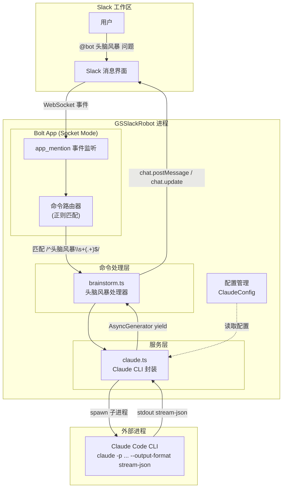
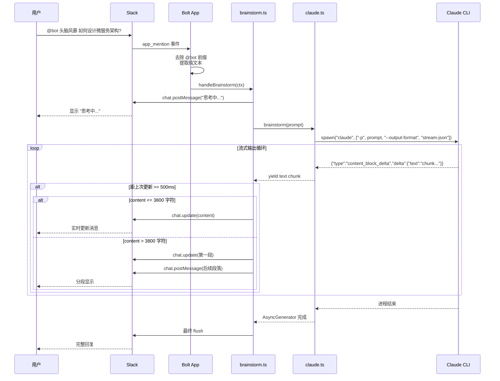
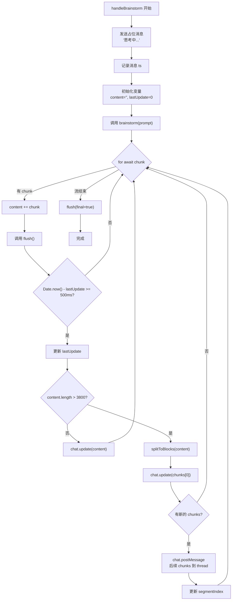
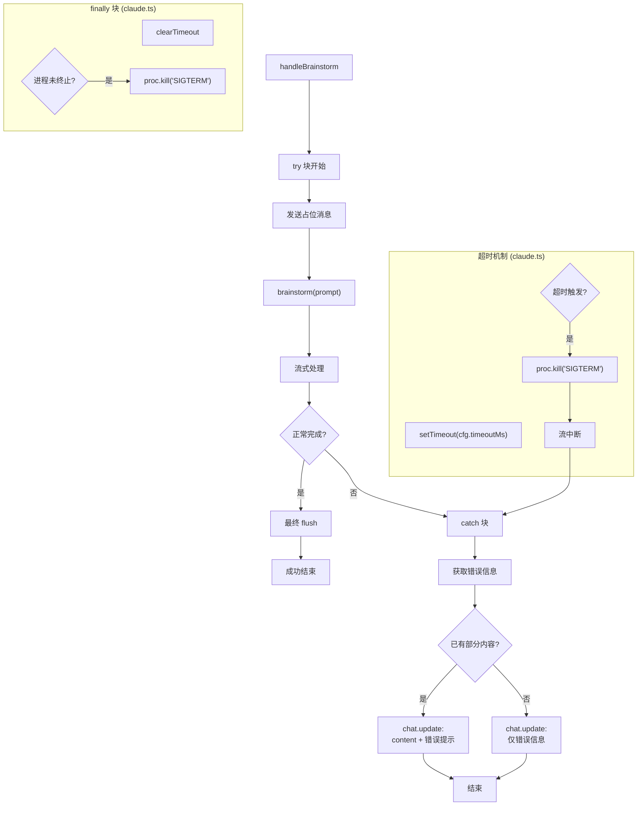

# Claude Code 集成文档

本文档详细说明 GSSlackRobot 与 Claude Code CLI 的集成方式，包括架构设计、数据流程和技术实现细节。

## 目录

- [概述](#概述)
- [架构概览](#架构概览)
- [数据流程](#数据流程)
- [配置选项](#配置选项)
- [技术实现细节](#技术实现细节)
- [消息流式输出机制](#消息流式输出机制)
- [错误处理与超时机制](#错误处理与超时机制)
- [故障排除](#故障排除)

---

## 概述

GSSlackRobot 通过 **子进程** 方式调用本机安装的 Claude Code CLI，实现 AI 驱动的头脑风暴功能。

### 核心特性

- **流式输出**: 实时显示 Claude 回复，无需等待完整响应
- **消息节流**: 500ms 间隔更新 Slack 消息，避免 API 限流
- **长文本分段**: 超过 3800 字符自动拆分为多条 thread 消息
- **超时保护**: 默认 5 分钟超时，防止进程挂起

### 触发方式

在 Slack 中 `@bot 头脑风暴 <你的问题>` 即可触发。

---

## 架构概览



### 组件说明

| 组件 | 文件 | 职责 |
|------|------|------|
| 命令路由器 | `src/commands/index.ts` | 解析 `app_mention` 事件，正则匹配分发到处理器 |
| 头脑风暴处理器 | `src/commands/brainstorm.ts` | 管理消息生命周期、节流更新、分段发送 |
| Claude 服务 | `src/services/claude.ts` | 封装 CLI 调用，解析 stream-json，提供 AsyncGenerator |
| 配置管理 | `src/config/index.ts` | 加载环境变量，提供 ClaudeConfig |

---

## 数据流程

### 完整时序图



### 流程步骤详解

1. **事件接收**: Slack Socket Mode 连接接收 `app_mention` 事件
2. **命令解析**: 去除 `<@BOT_ID>` 前缀，提取用户输入文本
3. **正则匹配**: 匹配 `^头脑风暴\s+(.+)$` 模式，捕获问题内容
4. **占位消息**: 立即发送 "思考中..." 消息到 thread
5. **子进程调用**: spawn Claude CLI，传入 prompt 和 stream-json 格式
6. **流式读取**: 逐行解析 stdout JSON，yield 文本片段
7. **消息更新**: 节流聚合后调用 `chat.update` 刷新消息
8. **长文本处理**: 超过阈值时拆分并发送到 thread
9. **最终刷新**: 流结束后确保所有内容已发送

---

## 配置选项

### 环境变量

| 变量名 | 类型 | 默认值 | 说明 |
|--------|------|--------|------|
| `CLAUDE_COMMAND` | string | `claude` | Claude CLI 命令名称或完整路径 |
| `CLAUDE_TIMEOUT_MS` | number | `300000` | 子进程超时时间（毫秒），默认 5 分钟 |

### 配置示例

```bash
# .env 文件
CLAUDE_COMMAND=claude
CLAUDE_TIMEOUT_MS=300000
```

### TypeScript 接口

```typescript
// src/config/schema.ts
export interface ClaudeConfig {
  command: string;    // CLI 命令名
  timeoutMs: number;  // 超时毫秒数
}
```

### 配置加载

```typescript
// src/config/index.ts
claude: {
  command: optional('CLAUDE_COMMAND', 'claude'),
  timeoutMs: optionalInt('CLAUDE_TIMEOUT_MS', 300000),
}
```

---

## 技术实现细节

### CLI 调用方式

```typescript
// src/services/claude.ts
const proc = spawn(cfg.command, ['-p', prompt, '--output-format', 'stream-json'], {
  stdio: ['ignore', 'pipe', 'pipe'],
});
```

**参数说明**:
- `-p <prompt>`: 传入用户问题
- `--output-format stream-json`: 启用流式 JSON 输出模式
- `stdio`: 忽略 stdin，捕获 stdout 和 stderr

### stream-json 输出格式

Claude CLI 在 `stream-json` 模式下输出两种 JSON 格式：

**1. 流式增量（主要）**
```json
{"type":"content_block_delta","delta":{"type":"text_delta","text":"这是一段回复文本..."}}
```

**2. 最终结果（备用）**
```json
{"type":"result","result":"完整的回复文本"}
```

### AsyncGenerator 实现

```typescript
// src/services/claude.ts
export async function* brainstorm(prompt: string): AsyncGenerator<string> {
  const cfg = getConfig().claude;
  const proc = spawn(cfg.command, ['-p', prompt, '--output-format', 'stream-json'], {
    stdio: ['ignore', 'pipe', 'pipe'],
  });

  // 设置超时定时器
  const timeout = setTimeout(() => {
    proc.kill('SIGTERM');
  }, cfg.timeoutMs);

  try {
    let buffer = '';
    for await (const chunk of proc.stdout) {
      buffer += chunk.toString();
      const lines = buffer.split('\n');
      buffer = lines.pop()!;  // 保留不完整的行

      for (const line of lines) {
        if (!line.trim()) continue;
        try {
          const data = JSON.parse(line);
          if (data.type === 'content_block_delta' && data.delta?.text) {
            yield data.delta.text;
          } else if (data.type === 'result' && data.result) {
            yield data.result;
          }
        } catch {
          // 非 JSON 行，跳过
        }
      }
    }
    // 处理残余 buffer
    // ...
  } finally {
    clearTimeout(timeout);
    if (!proc.killed) proc.kill('SIGTERM');
  }
}
```

---

## 消息流式输出机制



### 关键参数

| 参数 | 值 | 说明 |
|------|-----|------|
| `THROTTLE_MS` | 500 | 消息更新最小间隔（毫秒） |
| `MAX_MSG_LEN` | 3800 | 单条消息最大长度（字符） |

### 分段逻辑

```typescript
// src/utils/message.ts
export function splitToBlocks(text: string, maxLen: number = 3000): string[] {
  // 优先在换行处分割，保证可读性
  // 返回分段后的字符串数组
}
```

---

## 错误处理与超时机制



### 错误场景处理

| 场景 | 原因 | 用户看到的消息 |
|------|------|---------------|
| CLI 不存在 | 未安装 Claude Code 或 PATH 未配置 | `出错: spawn claude ENOENT` |
| 超时 | 响应时间超过 5 分钟 | 部分内容 + `_(出错: ...)_` |
| API 错误 | Claude API 返回错误 | 错误详情 |
| 网络中断 | 进程异常退出 | 已有内容 + 错误提示 |

### 错误消息格式

```typescript
// src/commands/brainstorm.ts
catch (err) {
  const errMsg = err instanceof Error ? err.message : String(err);
  await client.chat.update({
    channel,
    ts: msgTs,
    text: content ? `${content}\n\n_（出错: ${errMsg}）_` : `出错: ${errMsg}`,
  });
}
```

---

## 故障排除

### 1. 检查 Claude CLI 安装

```bash
# 验证 CLI 可用
which claude

# 测试 CLI 运行
claude -p "hello" --output-format stream-json
```

### 2. 检查环境变量

```bash
# 确认环境变量已设置
echo $CLAUDE_COMMAND
echo $CLAUDE_TIMEOUT_MS
```

### 3. 常见错误及解决方案

| 错误信息 | 原因 | 解决方案 |
|---------|------|---------|
| `spawn claude ENOENT` | Claude CLI 未安装或不在 PATH 中 | 安装 Claude Code 或设置完整路径 |
| `SIGTERM` 超时 | 响应时间过长 | 增加 `CLAUDE_TIMEOUT_MS` 值 |
| JSON 解析错误 | CLI 输出格式异常 | 检查 Claude Code 版本 |
| 消息更新失败 | Slack API 限流 | 检查 Bot Token 权限 |

### 4. 调试建议

1. **查看 stderr 输出**: 修改 `spawn` 配置捕获 stderr 进行调试
2. **增加日志**: 在 `brainstorm` 函数中添加 console.log
3. **手动测试**: 使用相同参数直接运行 Claude CLI
4. **检查权限**: 确保运行 GSSlackRobot 的用户有权限执行 Claude CLI

---

## 相关文件

- `src/services/claude.ts` - Claude CLI 子进程封装
- `src/commands/brainstorm.ts` - 头脑风暴命令处理器
- `src/config/schema.ts` - 配置类型定义
- `src/config/index.ts` - 配置加载逻辑
- `src/utils/message.ts` - 消息工具函数
