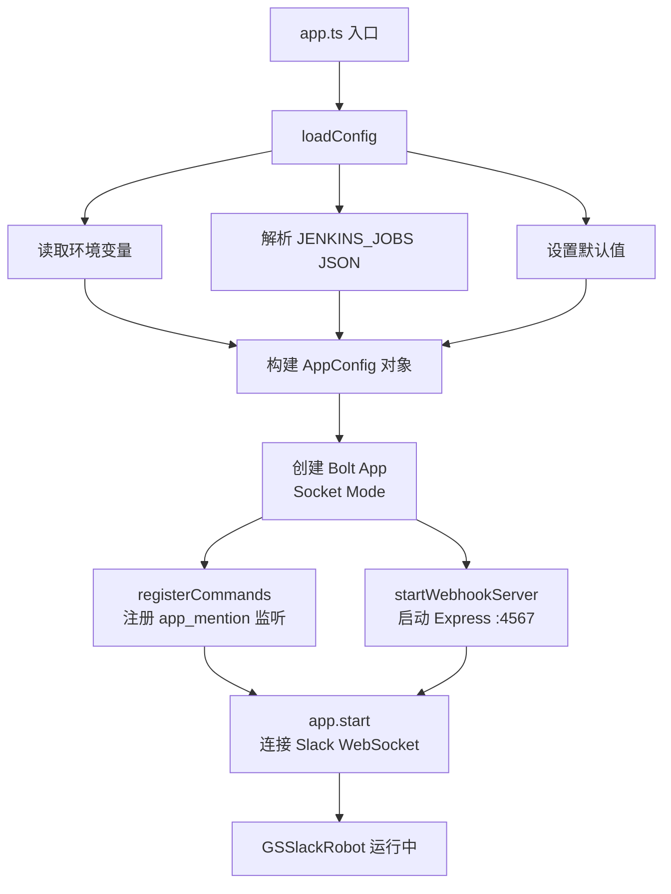
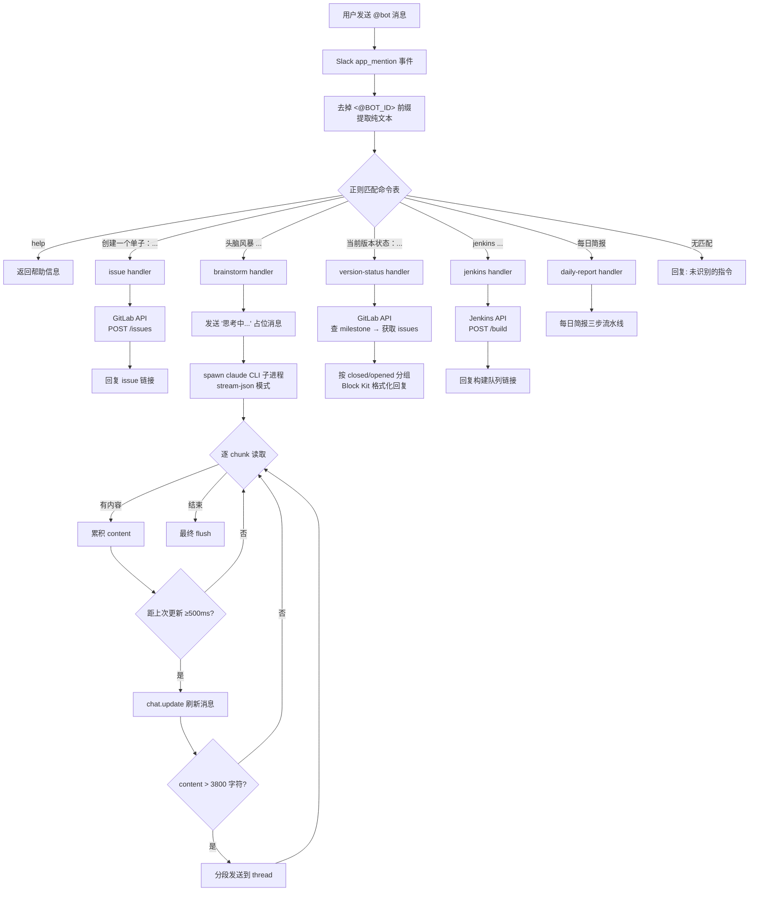
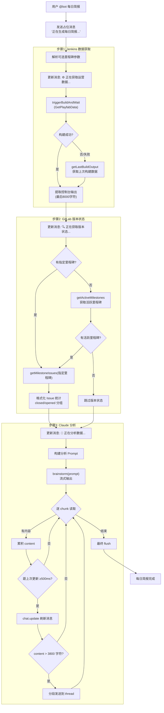
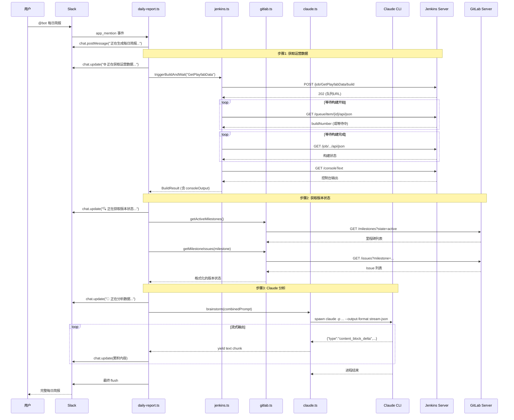
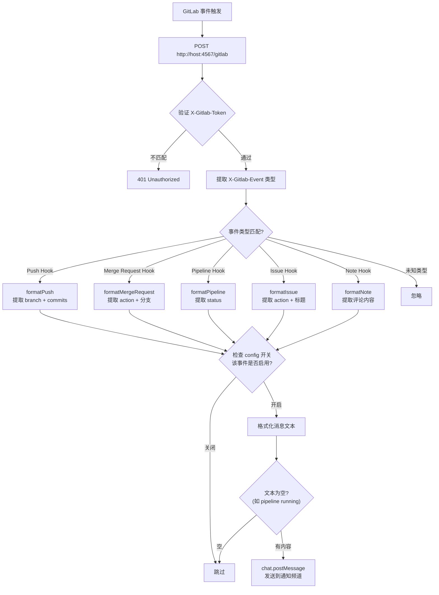
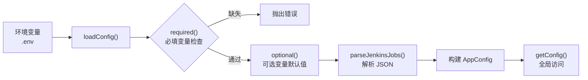
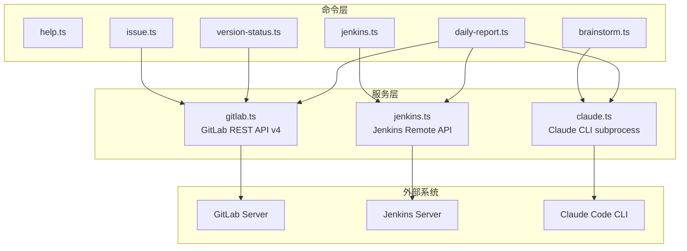
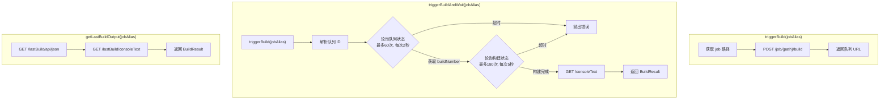
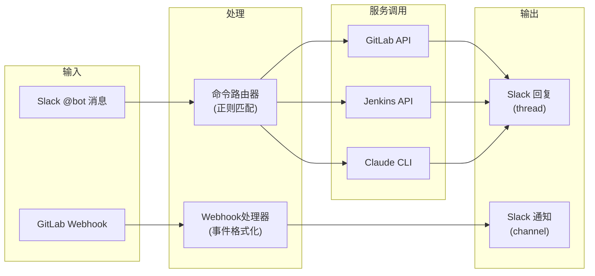

# 主要流程图

## 系统启动流程

```mermaid
flowchart TD
    A[app.ts 入口] --> B[loadConfig]
    B --> B1[读取环境变量]
    B --> B2[解析 JENKINS_JOBS JSON]
    B --> B3[设置默认值]
    B1 & B2 & B3 --> C[构建 AppConfig 对象]
    C --> D[创建 Bolt App<br/>Socket Mode]
    D --> E[registerCommands<br/>注册 app_mention 监听]
    D --> F[startWebhookServer<br/>启动 Express :4567]
    E & F --> G[app.start<br/>连接 Slack WebSocket]
    G --> H[GSSlackRobot 运行中]
```

## 命令处理流程

```mermaid
flowchart TD
    A["用户发送 @bot 消息"] --> B["Slack app_mention 事件"]
    B --> C["去掉 &lt;@BOT_ID&gt; 前缀<br/>提取纯文本"]
    C --> D{"正则匹配命令表"}

    D -- "help" --> E1[返回帮助信息]
    D -- "创建一个单子：..." --> E2[issue handler]
    D -- "头脑风暴 ..." --> E3[brainstorm handler]
    D -- "当前版本状态：..." --> E4[version-status handler]
    D -- "jenkins ..." --> E5[jenkins handler]
    D -- "每日简报" --> E6[daily-report handler]
    D -- "无匹配" --> E7["回复: 未识别的指令"]

    E2 --> F2["GitLab API<br/>POST /issues"]
    F2 --> G2["回复 issue 链接"]

    E3 --> F3["发送 '思考中...' 占位消息"]
    F3 --> F3a["spawn claude CLI 子进程<br/>stream-json 模式"]
    F3a --> F3b{"逐 chunk 读取"}
    F3b -- "有内容" --> F3c["累积 content"]
    F3c --> F3d{"距上次更新 ≥500ms?"}
    F3d -- "是" --> F3e["chat.update 刷新消息"]
    F3d -- "否" --> F3b
    F3e --> F3f{"content > 3800 字符?"}
    F3f -- "否" --> F3b
    F3f -- "是" --> F3g["分段发送到 thread"]
    F3g --> F3b
    F3b -- "结束" --> F3h["最终 flush"]

    E4 --> F4["GitLab API<br/>查 milestone → 获取 issues"]
    F4 --> G4["按 closed/opened 分组<br/>Block Kit 格式化回复"]

    E5 --> F5["Jenkins API<br/>POST /build"]
    F5 --> G5["回复构建队列链接"]

    E6 --> F6["每日简报三步流水线"]
```

## 每日简报处理流程

```mermaid
flowchart TD
    A["用户 @bot 每日简报"] --> B["发送占位消息<br/>'正在生成每日简报...'"]
    B --> C["解析可选里程碑参数"]

    subgraph Step1 ["步骤1: Jenkins 数据获取"]
        C --> D["更新消息: ⚙️ 正在获取运营数据..."]
        D --> E["triggerBuildAndWait<br/>(GetPlayfabData)"]
        E --> F{"构建成功?"}
        F -- "是" --> G["提取控制台输出<br/>(最后8000字符)"]
        F -- "否/失败" --> H["getLastBuildOutput<br/>获取上次构建数据"]
        H --> G
    end

    subgraph Step2 ["步骤2: GitLab 版本状态"]
        G --> I["更新消息: 🔍 正在获取版本状态..."]
        I --> J{"有指定里程碑?"}
        J -- "是" --> K["getMilestoneIssues(指定里程碑)"]
        J -- "否" --> L["getActiveMilestones<br/>获取活跃里程碑"]
        L --> M{"有活跃里程碑?"}
        M -- "是" --> K
        M -- "否" --> N["跳过版本状态"]
        K --> O["格式化 Issue 统计<br/>closed/opened 分组"]
    end

    subgraph Step3 ["步骤3: Claude 分析"]
        O --> P["更新消息: 🧠 正在分析数据..."]
        N --> P
        P --> Q["构建分析 Prompt"]
        Q --> R["brainstorm(prompt)<br/>流式输出"]
        R --> S{"逐 chunk 读取"}
        S -- "有内容" --> T["累积 content"]
        T --> U{"距上次更新 ≥500ms?"}
        U -- "是" --> V["chat.update 刷新消息"]
        U -- "否" --> S
        V --> W{"content > 3800 字符?"}
        W -- "否" --> S
        W -- "是" --> X["分段发送到 thread"]
        X --> S
        S -- "结束" --> Y["最终 flush"]
    end

    Y --> Z["每日简报完成"]
```

## 每日简报时序图

```mermaid
sequenceDiagram
    participant U as 用户
    participant S as Slack
    participant H as daily-report.ts
    participant J as jenkins.ts
    participant G as gitlab.ts
    participant C as claude.ts
    participant CLI as Claude CLI
    participant JK as Jenkins Server
    participant GL as GitLab Server

    U->>S: @bot 每日简报
    S->>H: app_mention 事件

    H->>S: chat.postMessage("正在生成每日简报...")

    Note over H,JK: 步骤1: 获取运营数据
    H->>S: chat.update("⚙️ 正在获取运营数据...")
    H->>J: triggerBuildAndWait("GetPlayfabData")
    J->>JK: POST /job/GetPlayfabData/build
    JK-->>J: 202 (队列URL)

    loop 等待构建开始
        J->>JK: GET /queue/item/{id}/api/json
        JK-->>J: buildNumber (或等待中)
    end

    loop 等待构建完成
        J->>JK: GET /job/.../api/json
        JK-->>J: 构建状态
    end

    J->>JK: GET /consoleText
    JK-->>J: 控制台输出
    J-->>H: BuildResult (含 consoleOutput)

    Note over H,GL: 步骤2: 获取版本状态
    H->>S: chat.update("🔍 正在获取版本状态...")
    H->>G: getActiveMilestones()
    G->>GL: GET /milestones?state=active
    GL-->>G: 里程碑列表
    H->>G: getMilestoneIssues(milestone)
    G->>GL: GET /issues?milestone=...
    GL-->>G: Issue 列表
    G-->>H: 格式化的版本状态

    Note over H,CLI: 步骤3: Claude 分析
    H->>S: chat.update("🧠 正在分析数据...")
    H->>C: brainstorm(combinedPrompt)
    C->>CLI: spawn claude -p ... --output-format stream-json

    loop 流式输出
        CLI-->>C: {"type":"content_block_delta",...}
        C-->>H: yield text chunk
        H->>S: chat.update(累积内容)
    end

    CLI-->>C: 进程结束
    H->>S: 最终 flush
    S-->>U: 完整每日简报
```

## GitLab Webhook 处理流程

```mermaid
flowchart TD
    A["GitLab 事件触发"] --> B["POST http://host:4567/gitlab"]
    B --> C{"验证 X-Gitlab-Token"}
    C -- "不匹配" --> D["401 Unauthorized"]
    C -- "通过" --> E["提取 X-Gitlab-Event 类型"]
    E --> F{"事件类型匹配?"}

    F -- "Push Hook" --> G1["formatPush<br/>提取 branch + commits"]
    F -- "Merge Request Hook" --> G2["formatMergeRequest<br/>提取 action + 分支"]
    F -- "Pipeline Hook" --> G3["formatPipeline<br/>提取 status"]
    F -- "Issue Hook" --> G4["formatIssue<br/>提取 action + 标题"]
    F -- "Note Hook" --> G5["formatNote<br/>提取评论内容"]
    F -- "未知类型" --> G6["忽略"]

    G1 & G2 & G3 & G4 & G5 --> H{"检查 config 开关<br/>该事件是否启用?"}
    H -- "关闭" --> I["跳过"]
    H -- "开启" --> J["格式化消息文本"]
    J --> K{"文本为空?<br/>(如 pipeline running)"}
    K -- "空" --> I
    K -- "有内容" --> L["chat.postMessage<br/>发送到通知频道"]
```

## 配置加载流程

```mermaid
flowchart LR
    A["环境变量<br/>.env"] --> B["loadConfig()"]
    B --> C{"required()<br/>必填变量检查"}
    C -- "缺失" --> D["抛出错误"]
    C -- "通过" --> E["optional()<br/>可选变量默认值"]
    E --> F["parseJenkinsJobs()<br/>解析 JSON"]
    F --> G["构建 AppConfig"]
    G --> H["getConfig()<br/>全局访问"]
```

## 服务层架构

```mermaid
flowchart TB
    subgraph Commands ["命令层"]
        Help["help.ts"]
        Issue["issue.ts"]
        Brainstorm["brainstorm.ts"]
        VersionStatus["version-status.ts"]
        Jenkins["jenkins.ts"]
        DailyReport["daily-report.ts"]
    end

    subgraph Services ["服务层"]
        GitLabSvc["gitlab.ts<br/>GitLab REST API v4"]
        JenkinsSvc["jenkins.ts<br/>Jenkins Remote API"]
        ClaudeSvc["claude.ts<br/>Claude CLI subprocess"]
    end

    subgraph External ["外部系统"]
        GitLab["GitLab Server"]
        JenkinsServer["Jenkins Server"]
        ClaudeCLI["Claude Code CLI"]
    end

    Issue --> GitLabSvc
    Brainstorm --> ClaudeSvc
    VersionStatus --> GitLabSvc
    Jenkins --> JenkinsSvc
    DailyReport --> JenkinsSvc
    DailyReport --> GitLabSvc
    DailyReport --> ClaudeSvc

    GitLabSvc --> GitLab
    JenkinsSvc --> JenkinsServer
    ClaudeSvc --> ClaudeCLI
```

## Jenkins 服务详细流程

```mermaid
flowchart TD
    subgraph TriggerBuild ["triggerBuild(jobAlias)"]
        A1["获取 job 路径"] --> A2["POST /job/{path}/build"]
        A2 --> A3["返回队列 URL"]
    end

    subgraph TriggerAndWait ["triggerBuildAndWait(jobAlias)"]
        B1["triggerBuild(jobAlias)"] --> B2["解析队列 ID"]
        B2 --> B3{"轮询队列状态<br/>最多60次, 每次2秒"}
        B3 -- "获取 buildNumber" --> B4{"轮询构建状态<br/>最多180次, 每次5秒"}
        B3 -- "超时" --> B5["抛出错误"]
        B4 -- "构建完成" --> B6["GET /consoleText"]
        B4 -- "超时" --> B5
        B6 --> B7["返回 BuildResult"]
    end

    subgraph GetLastOutput ["getLastBuildOutput(jobAlias)"]
        C1["GET /lastBuild/api/json"] --> C2["GET /lastBuild/consoleText"]
        C2 --> C3["返回 BuildResult"]
    end
```

## 数据流概览

```mermaid
flowchart LR
    subgraph Input ["输入"]
        SlackMsg["Slack @bot 消息"]
        GitLabWH["GitLab Webhook"]
    end

    subgraph Processing ["处理"]
        Router["命令路由器<br/>(正则匹配)"]
        WHHandler["Webhook处理器<br/>(事件格式化)"]
    end

    subgraph Services ["服务调用"]
        API1["GitLab API"]
        API2["Jenkins API"]
        API3["Claude CLI"]
    end

    subgraph Output ["输出"]
        SlackReply["Slack 回复<br/>(thread)"]
        SlackNotify["Slack 通知<br/>(channel)"]
    end

    SlackMsg --> Router
    Router --> API1
    Router --> API2
    Router --> API3
    API1 --> SlackReply
    API2 --> SlackReply
    API3 --> SlackReply

    GitLabWH --> WHHandler
    WHHandler --> SlackNotify
```
