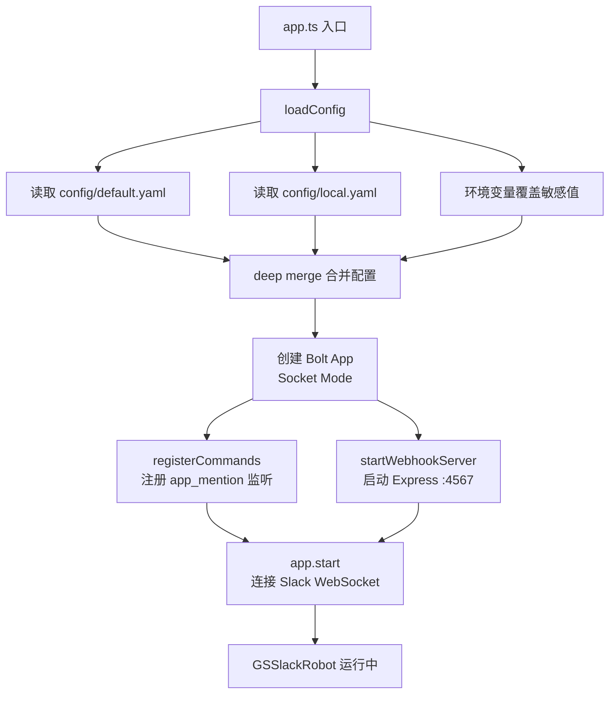
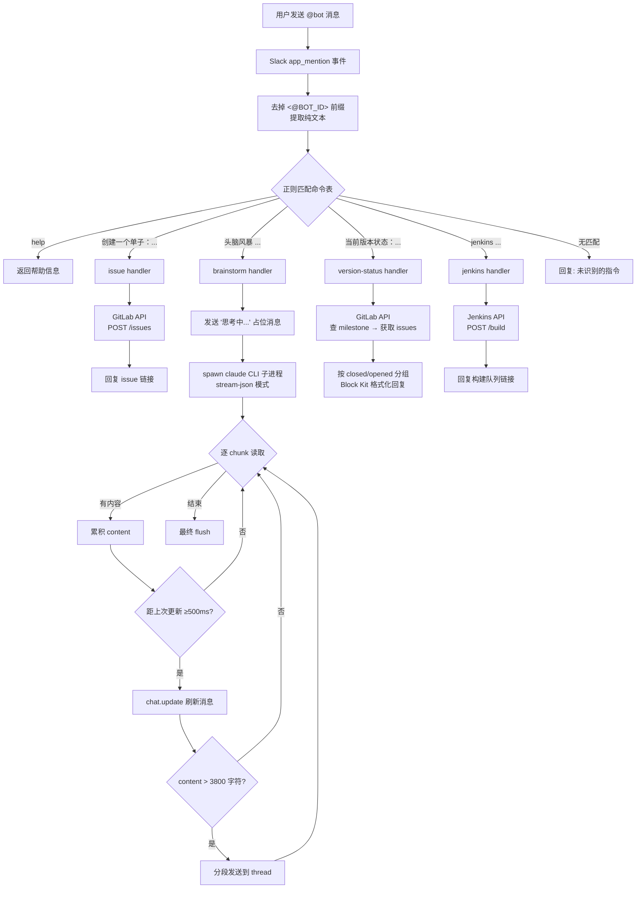
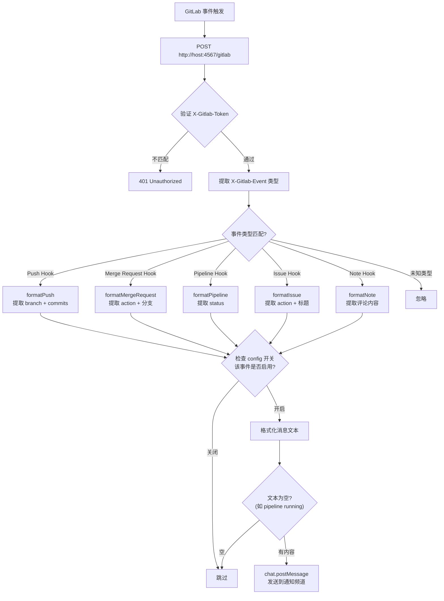
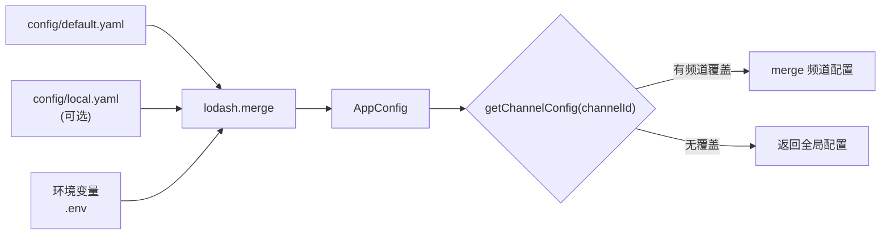

# 主要流程图

## 系统启动流程

```mermaid
flowchart TD
    A[app.ts 入口] --> B[loadConfig]
    B --> B1[读取 config/default.yaml]
    B --> B2[读取 config/local.yaml]
    B --> B3[环境变量覆盖敏感值]
    B1 & B2 & B3 --> C[deep merge 合并配置]
    C --> D[创建 Bolt App<br/>Socket Mode]
    D --> E[registerCommands<br/>注册 app_mention 监听]
    D --> F[startWebhookServer<br/>启动 Express :4567]
    E & F --> G[app.start<br/>连接 Slack WebSocket]
    G --> H[GSSlackRobot 运行中]
```

## 命令处理流程

```mermaid
flowchart TD
    A["用户发送 @bot 消息"] --> B["Slack app_mention 事件"]
    B --> C["去掉 &lt;@BOT_ID&gt; 前缀<br/>提取纯文本"]
    C --> D{"正则匹配命令表"}

    D -- "help" --> E1[返回帮助信息]
    D -- "创建一个单子：..." --> E2[issue handler]
    D -- "头脑风暴 ..." --> E3[brainstorm handler]
    D -- "当前版本状态：..." --> E4[version-status handler]
    D -- "jenkins ..." --> E5[jenkins handler]
    D -- "无匹配" --> E6["回复: 未识别的指令"]

    E2 --> F2["GitLab API<br/>POST /issues"]
    F2 --> G2["回复 issue 链接"]

    E3 --> F3["发送 '思考中...' 占位消息"]
    F3 --> F3a["spawn claude CLI 子进程<br/>stream-json 模式"]
    F3a --> F3b{"逐 chunk 读取"}
    F3b -- "有内容" --> F3c["累积 content"]
    F3c --> F3d{"距上次更新 ≥500ms?"}
    F3d -- "是" --> F3e["chat.update 刷新消息"]
    F3d -- "否" --> F3b
    F3e --> F3f{"content > 3800 字符?"}
    F3f -- "否" --> F3b
    F3f -- "是" --> F3g["分段发送到 thread"]
    F3g --> F3b
    F3b -- "结束" --> F3h["最终 flush"]

    E4 --> F4["GitLab API<br/>查 milestone → 获取 issues"]
    F4 --> G4["按 closed/opened 分组<br/>Block Kit 格式化回复"]

    E5 --> F5["Jenkins API<br/>POST /build"]
    F5 --> G5["回复构建队列链接"]
```

## GitLab Webhook 处理流程

```mermaid
flowchart TD
    A["GitLab 事件触发"] --> B["POST http://host:4567/gitlab"]
    B --> C{"验证 X-Gitlab-Token"}
    C -- "不匹配" --> D["401 Unauthorized"]
    C -- "通过" --> E["提取 X-Gitlab-Event 类型"]
    E --> F{"事件类型匹配?"}

    F -- "Push Hook" --> G1["formatPush<br/>提取 branch + commits"]
    F -- "Merge Request Hook" --> G2["formatMergeRequest<br/>提取 action + 分支"]
    F -- "Pipeline Hook" --> G3["formatPipeline<br/>提取 status"]
    F -- "Issue Hook" --> G4["formatIssue<br/>提取 action + 标题"]
    F -- "Note Hook" --> G5["formatNote<br/>提取评论内容"]
    F -- "未知类型" --> G6["忽略"]

    G1 & G2 & G3 & G4 & G5 --> H{"检查 config 开关<br/>该事件是否启用?"}
    H -- "关闭" --> I["跳过"]
    H -- "开启" --> J["格式化消息文本"]
    J --> K{"文本为空?<br/>(如 pipeline running)"}
    K -- "空" --> I
    K -- "有内容" --> L["chat.postMessage<br/>发送到通知频道"]
```

## 配置加载流程

```mermaid
flowchart LR
    A["config/default.yaml"] --> D["lodash.merge"]
    B["config/local.yaml<br/>(可选)"] --> D
    C["环境变量<br/>.env"] --> D
    D --> E["AppConfig"]
    E --> F{"getChannelConfig(channelId)"}
    F -- "有频道覆盖" --> G["merge 频道配置"]
    F -- "无覆盖" --> H["返回全局配置"]
```
